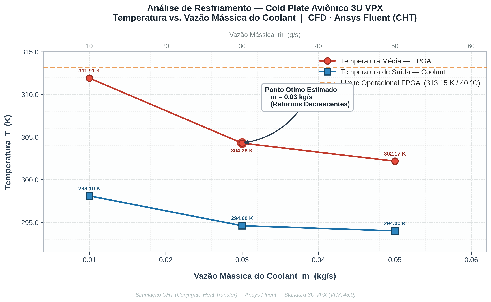

# Cold Plate Thermal Analysis — 3U VPX Avionics
### CHT (Conjugate Heat Transfer) Analysis with Ansys Fluent

<div align="center">


</div>

---

## About

<table>
<tr>
<td width="55%">

This repository documents the **thermofluidodynamic optimization** of a *cold plate* in the **3U VPX** standard, developed as part of the Aerospace Engineering program at the University of Brasília.

The core objective was to find the **ideal operating point** between the cooling efficiency of a high-power FPGA and the fluid pumping effort — a fundamental trade-off in aerospace embedded systems, where every watt drawn by the pump competes directly with the mission.

> *"As power density increases in embedded systems, heat dissipation has shifted from a design detail to the very* gating factor *of development."*

</td>
<td width="45%" align="center">


<sub><i>Temperature distribution across the cold plate simulated in Ansys Fluent</i></sub>

</td>
</tr>
</table>

---

## Methodology

<table>
<tr>
<td width="50%">

| Stage | Tool | Details |
|---|---|---|
| Modeling | Ansys | Cold plate with internal microchannels |
| CFD Solver | Ansys Fluent 2026 R1 | CHT — Conjugate Heat Transfer |
| Turbulence Model | k-ω SST | Suitable for confined channel flows |
| Post-processing | Python | Curve generation and convergence analysis |

Three mass flow rates were tested to map the system's thermal behavior:

```
m1 = 0.01 kg/s  →  low pumping regime
m2 = 0.03 kg/s  →  optimal point ✓
m3 = 0.05 kg/s  →  diminishing returns regime
```

</td>
<td width="50%" align="center">


<sub><i>Heat concentration zone at the direct FPGA contact surface</i></sub>

</td>
</tr>
</table>

---

## Results

### Equilibrium Temperatures

<table>
<tr>
<td width="45%">

| Flow Rate (kg/s) | FPGA (K) | Fluid Outlet (K) |
|:---:|:---:|:---:|
| 0.01 | 311.91 | 298.10 |
| **0.03** | **304.28** | **294.60** |
| 0.05 | 302.17 | 294.00 |

> **FPGA operational limit:** 313.15 K (40 °C)

Doubling the flow rate from **0.01 to 0.03 kg/s** drops the FPGA temperature by **7.63 K**. Going from **0.03 to 0.05 kg/s**, however, yields only **2.11 K** of additional relief — a marginal gain that does not justify the extra pump energy consumption.

</td>
<td width="55%" align="center">


<sub><i>Cooling curve: the flattening after 0.03 kg/s defines the optimal operating point</i></sub>

</td>
</tr>
</table>

---

### Solver Convergence

<table>
<tr>
<td width="55%" align="center">


<sub><i>Outlet temperature stabilization for m = 0.03 kg/s</i></sub>

</td>
<td width="45%">

**On convergence:**

The solver stabilized the fluid outlet temperature at **294.60 K** after approximately 200 iterations for the optimal flow rate.

The smooth stabilization curve confirms that the k-ω SST model adequately captured the turbulent flow regime inside the microchannels, with no significant numerical oscillations.

</td>
</tr>
</table>

---

## Conclusion

The analysis confirmed that **0.03 kg/s is the ideal flow rate** for this cold plate: it delivers effective FPGA cooling — well below the 313.15 K operational limit — without overloading the aircraft's hydraulic system.

Increasing to 0.05 kg/s provides only ~2 K of additional relief, which **does not justify the extra pump energy cost** in an embedded system where every resource is critical.

---

## Tech Stack

- **Ansys Fluent 2026 R1** — CFD solver and CHT
- **Python 3.11 + Matplotlib / NumPy** — post-processing and data visualization

---

<div align="center">
<sub>Developed as an academic project in computational thermodynamics applied to aerospace engineering.</sub>
</div>